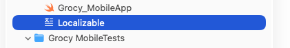
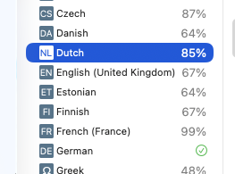
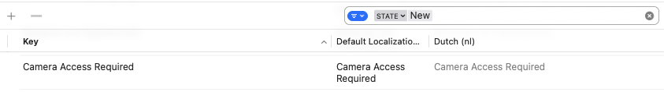

# Translation in other languages

You are welcome to translate Grocy Mobile into other languages.

This is for the most part only needed for the App-specific strings, which are not available on the Grocy interface.
So please check if the translation you want is already applied at the upstream [Grocy Transifex](https://explore.transifex.com/grocy/grocy/) and help out there.

Since version 3.0, the translation is integrated in the Xcode project, so you just need to do this steps:

1. Clone the project
2. Open the project in Xcode
3. Select the localizable file

4. Select the language you want to translate, showing a percentage 

5. (optional) Filter the translations, e.g. by new
6. Enter the translated strings

7. Create a PR if you have completed a significant amount of translation

Please don't hesitate to ask if there is a problem and happy translating!
